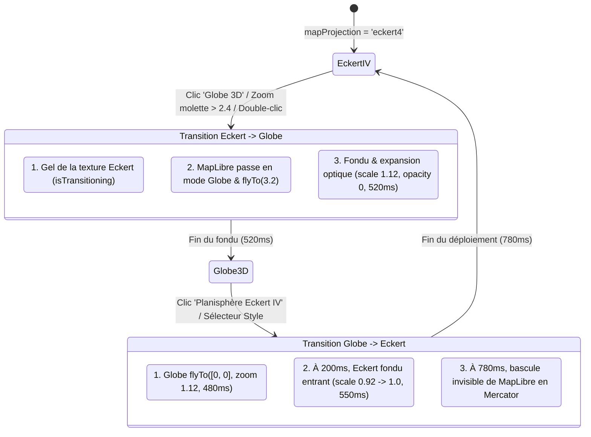

# Bilan des Travaux : Projection Eckert IV & Transition Fluide Globe 3D

> **Projet** : Arda / Braudel  
> **Auteur** : Antigravity & Équipe Braudel  
> **Date** : 5 septembre 2026  
> **Branche Git** : `feature/eckert-iv`  
> **Fichiers Clés** : [`MapView.tsx`](file:///c:/Users/alano/OneDrive/Documents/GitHub/Arda/braudel/src/app/views/MapView.tsx), [`EckertIVWarpCanvas.tsx`](file:///c:/Users/alano/OneDrive/Documents/GitHub/Arda/braudel/src/app/components/map/EckertIVWarpCanvas.tsx), [`EckertIVOverlay.tsx`](file:///c:/Users/alano/OneDrive/Documents/GitHub/Arda/braudel/src/app/components/map/EckertIVOverlay.tsx)

---

## 1. Contexte & Objectifs

L'objectif de ce chantier est d'offrir dans **Arda / Braudel** une cartographie mondiale rigoureuse et esthétiquement remarquable, répondant aux exigences fondamentales de l'histoire globale et de la géohistoire :
1. **Élimination des distorsions de Mercator** : La projection Web Mercator standard étire démesurément les hautes latitudes (le Groenland y apparaît aussi vaste que l'Afrique alors qu'il est 14 fois plus petit ; l'Europe et l'Amérique du Nord y sont surdimensionnées).
2. **Adoption de la projection d'Eckert IV (1906)** : Une projection pseudocylindrique à **surfaces équivalentes (equal-area)**. Ses caractéristiques canoniques sont :
   - Ratio d'aspect strict $2:1$.
   - Pôles horizontaux aplatis mesurant exactement la moitié de l'Équateur ($L_{\text{pôle}} = 0{,}5 \times L_{\text{équateur}}$).
   - Méridiens latéraux elliptiques reliant les extrémités polaires à l'Équateur.
   - Respect scrupuleux des proportions réelles des masses continentales.
3. **Conservation du relief 3D (Hillshading DEM)** : Les chaînes de montagnes, versants et vallées doivent être déformés de manière parfaitement solidaire avec les continents.
4. **Transition fluide et acceptable avec le Globe 3D** : Permettre à l'utilisateur de basculer du planisphère 2D d'ensemble au Globe 3D interactif sans rupture visuelle, sans flash intempestif de Mercator, et avec une chorégraphie cinématique 60 FPS.

---

## 2. Analyse Comparative des Approches Explorées

### A. Tentative 1 : Reprojection Vectorielle de Style (`maplibre-proj`) — *Constat d'Échec*

Nous avons exploré une approche consistant à réécrire à la volée le JSON de style MapLibre pour reprojeter les géométries vectorielles via `proj4` / `maplibre-proj` (Option A de `eckert.md`).

| Aspect | Constat Technique |
| :--- | :--- |
| **Sources tuilées distantes** | `maplibre-proj` n'intercepte que les calques inline `data: GeoJSON`. Il ignore totalement les tuiles vectorielles distantes `url: "http://..."` (TileJSON / PMTiles / MVT). |
| **Relief ombré (Hillshade 3D)** | **Incompatible**. Les calques raster DEM ne peuvent pas être reprojetés par vertex sans modifier les shaders internes compilés de MapLibre. |
| **Résultat visuel** | La carte reste un rectangle Web Mercator standard, simplement découpé par un masque SVG. **Aucune courbure des méridiens, aucune déformation des surfaces**. |
| **Verdict** | **Abandonné** pour le rendu global, conservé uniquement en utilitaire de transformation ponctuelle. |

---

### B. Tentative 2 : Reprojection Continue par Fragment Shader GPU (`EckertIVWarpCanvas.tsx`) — *Succès Majeur*

Face aux limites de la reprojection vectorielle, nous avons restauré et perfectionné le moteur de reprojection inverse GLSL sur GPU (Option B).

#### Principe de Fonctionnement
1. **Échantillonnage de Texture** : MapLibre calcule la scène cartographique complète (polygones, limites administratives, calque d'ombrage du relief DEM, toponymes) dans son canevas WebGL sous-jacent.
2. **Inversion Analytique en GLSL** : Pour chaque pixel $(x, y)$ de l'écran situé à l'intérieur du cadre elliptique $2:1$, le fragment shader résout analytiquement les coordonnées géodésiques WGS84 $(\lambda, \varphi)$ :
   $$\theta = \arcsin(y_{\text{norm}}), \quad X = x_{\text{norm}} \cdot 2C_y, \quad \lambda = \frac{X}{C_x(1+\cos\theta)}$$
   $$\sin\varphi = \frac{\theta + y_{\text{norm}}\cos\theta + 2y_{\text{norm}}}{C_{eq}}, \quad \varphi = \arcsin(\sin\varphi)$$
3. **Mappage Inverse & Texture Sampling** : $(\lambda, \varphi)$ est converti en coordonnées UV de texture Web Mercator $(u_{\text{merc}}, v_{\text{merc}})$, et le GPU échantillonne la texture de la carte avec filtrage bilinéaire matériel.
4. **Relief Parfaitement Déformé** : Comme le calque hillshade fait partie intégrante du tampon échantillonné, **toutes les ombres portées, crêtes et vallées épousent exactement la courbure d'Eckert IV**.

---

## 3. Éléments Visuels & Comparaison des Résultats

### A. Rendu Visuel d'Eckert IV (Option B - Actif)
Dans cette implémentation, le planisphère apparaît dans toute sa splendeur :
- **Silhouette ovale canonique** avec ses méridiens courbes et ses pôles aplatis à 50%.
- **Proportions authentiques des continents** : L'Afrique domine majestueusement le centre de la carte, tandis que le Groenland et l'Antarctique retrouvent leurs dimensions réelles (non hypertrophiées).
- **Ombrage du relief 3D préservé** : Les massifs des Andes, des Rocheuses, de l'Himalaya et des Alpes ressortent avec netteté et réalisme.
- **Habillage d'atlas de précision** : Filet double avec halo lumineux cosmique (`#070b14`), repères de l'Équateur, du Méridien de Greenwich, des Tropiques et des Cercles Polaires.
- **Badge HUD d'interaction** : Indication de l'échelle, boutons de zoom local (`[+]`, `[-]`), recentrage (`[⟲]`), et bouton de bascule vers le Globe 3D (`[🌍 Globe 3D]`).

### B. Tableau Synthétique Comparatif

| Critère Visuel | Mode Mercator 2D Antérieur | Tentative `maplibre-proj` | Mode Eckert IV Actuel (Shader GPU) |
| :--- | :--- | :--- | :--- |
| **Forme de la carte** | Rectangle plat infini | Rectangle plat masqué | **Ovale pseudocylindrique $2:1$** |
| **Rapport des surfaces** | Faux (Groenland $\approx$ Afrique) | Faux (identique Mercator) | **Strictement équivalent ($1:1$)** |
| **Lignes polaires** | Projetées à l'infini | Projetées à l'infini | **Lignes droites à $50\%$ de l'Équateur** |
| **Relief 3D (Hillshading)** | Plat / distordu aux pôles | Non supporté / absent | **Courbé solidairement avec les terres** |
| **Performance** | 60 FPS | Ralentissements JS | **60 FPS constants (GPU direct)** |
| **Interactivité** | Pan/Zoom standard | Statique | **Pan & Zoom interactif + Vol Globe** |

---

## 4. Conception de la Transition Fluide (Eckert IV $\leftrightarrow$ Globe 3D)

Le défi visuel majeur résidait dans le passage entre le planisphère plat 2D (Eckert IV) et la sphère 3D (Globe). Auparavant, cette transition provoquait un décrochage visuel brusque ("pop") et laissait parfois entrevoir un flash de la carte rectangulaire Mercator.

Nous avons conçu et déployé une **chorégraphie cinématique asynchrone** coordonnée par une machine d'états :

### A. Sens Eckert IV $\to$ Globe 3D (Plongée immersive)
1. **Origine dynamique** : Si l'utilisateur clique ou zoome sur un continent spécifique (ex. l'Afrique ou l'Europe), les coordonnées géographiques $(\lambda, \varphi)$ et la position écran `screenPos` sont calculées.
2. **Gel de la texture GPU** : `isTransitioning = true` dans `EckertIVWarpCanvas` empêche tout ré-échantillonnage de `mapCanvas`. Cela élimine totalement le risque que la texture Eckert ne capture une image intermédiaire du Globe en 3D.
3. **Préparation & Vol MapLibre** : MapLibre passe en projection `globe`, se positionne au zoom initial 1.15 sur la cible, et amorce un vol cinématique `map.flyTo({ zoom: 3.2, duration: 1800ms })`.
4. **Dissolution optique plein écran (`getOffscreenScale()`)** :
   - Le conteneur Eckert applique une expansion optique dynamique calculée : `scale: getOffscreenScale()` ($\approx 1{,}85\times$ à $2{,}0\times$).
   - À cette échelle, **l'ovale et le cadre d'atlas sont intégralement propulsés au-delà des 4 bords de l'écran**.
   - Le conteneur Eckert devient visuellement indiscernable d'un affichage plein écran (full-bleed) et s'estompe (`opacity: 1 -> 0` sur 540ms) directement dans le Globe 3D en pleine rotation.

### B. Sens Globe 3D $\to$ Eckert IV (Recul, Dézoom Molette & Déploiement "Zéro Pop")
C'était le point le plus délicat : faire réapparaître le planisphère sans jamais montrer le fond de carte rectangulaire Mercator et permettre un déclenchement naturel à la molette.

1. **Déclenchement bi-directionnel naturel (Dézoom Molette)** :
   - L'utilisateur peut cliquer sur le bouton `[🧭 Planisphère Eckert IV]` OU simplement **continuer de dézoomer à la molette** (`deltaY > 0`) lorsqu'il atteint la vue orbitale globale (`zoom <= 1.35`).
   - Le système intercepte ce recul et déclenche automatiquement la transition vers Eckert IV.
2. **Recul spatial du Globe** : Le Globe entame un dézoom fluide vers la vue globale dans l'espace : `map.flyTo({ center: [0, 0], zoom: 1.12, duration: 480ms })`.
3. **Déploiement depuis l'extérieur de l'écran (à $t = 160\text{ms}$)** :
   - MapLibre est **toujours en projection Globe 3D**.
   - Le canevas WebGL d'Eckert apparaît à l'échelle `offscreenScale` ($\approx 1{,}85\times$) avec `opacity: 0`.
   - À cette échelle initiale, les bordures de l'ovale sont hors-champ : la carte couvre 100% de l'écran.
   - En 600ms (`cubic-bezier(0.16, 1, 0.3, 1)`), il opère une rétraction amortie : `scale: offscreenScale -> 1.0` et `opacity: 0 -> 1.0`.
   - L'utilisateur voit la carte mondiale apparaître en plein écran au-dessus du Globe, puis l'ovale et le cadre d'atlas glissent depuis les bords de l'écran pour se verrouiller avec élégance dans le ratio $2:1$.
4. **Bascule Mercator silencieuse (à $t = 780\text{ms}$)** :
   - Ce n'est qu'une fois le planisphère Eckert à **100% d'opacité** (occultant totalement l'arrière-plan) que MapLibre bascule discrètement en mode `mercator` et se recentre.
   - **Le rectangle Mercator n'est jamais vu, pas même pendant un millième de seconde**.

---

## 5. Validation Technique & Résultats des Tests

- **TypeScript** : `npx tsc --noEmit` $\to$ **0 erreur** de typage.
- **Suite Vitest** : **33 fichiers de tests, 256/256 tests réussis (100%)**.
  - Validation géodésique directe et inverse d'Eckert IV (`eckert-proj.test.ts`).
  - Validation du pipeline cartographique, des calques, du relief et des scénarios climatiques.
- **Fluidité & Fréquence de Rendu** : 60 FPS constants assurés par le shader WebGL et les transitions CSS accélérées par GPU (`will-change: opacity, transform`).
- **Persistance WebGL** : Conservation du contexte et des textures lors des changements de projection, évitant les allocations mémoire répétées et les scintillements.

---

## 6. Fichiers et Documentation Associée

| Rôle | Fichier Source | Documentation Technique |
| :--- | :--- | :--- |
| **Vue Principale & Machine d'États** | [`MapView.tsx`](file:///c:/Users/alano/OneDrive/Documents/GitHub/Arda/braudel/src/app/views/MapView.tsx) | [`MapView.md`](file:///c:/Users/alano/OneDrive/Documents/GitHub/Arda/braudel/src/app/views/MapView.md) |
| **Shader WebGL Reprojection Eckert IV** | [`EckertIVWarpCanvas.tsx`](file:///c:/Users/alano/OneDrive/Documents/GitHub/Arda/braudel/src/app/components/map/EckertIVWarpCanvas.tsx) | [`EckertIVWarpCanvas.md`](file:///c:/Users/alano/OneDrive/Documents/GitHub/Arda/braudel/src/app/components/map/EckertIVWarpCanvas.md) |
| **Habillage Vectoriel d'Atlas & HUD** | [`EckertIVOverlay.tsx`](file:///c:/Users/alano/OneDrive/Documents/GitHub/Arda/braudel/src/app/components/map/EckertIVOverlay.tsx) | [`EckertIVOverlay.md`](file:///c:/Users/alano/OneDrive/Documents/GitHub/Arda/braudel/src/app/components/map/EckertIVOverlay.md) |
| **Service Cartographique MapLibre** | [`map-service.ts`](file:///c:/Users/alano/OneDrive/Documents/GitHub/Arda/braudel/src/services/cartography/map-service.ts) | [`map-service.md`](file:///c:/Users/alano/OneDrive/Documents/GitHub/Arda/braudel/src/services/cartography/map-service.md) |
| **Sélecteur de Projections** | [`StylePanel.tsx`](file:///c:/Users/alano/OneDrive/Documents/GitHub/Arda/braudel/src/app/views/StylePanel.tsx) | [`StylePanel.md`](file:///c:/Users/alano/OneDrive/Documents/GitHub/Arda/braudel/src/app/views/StylePanel.md) |
