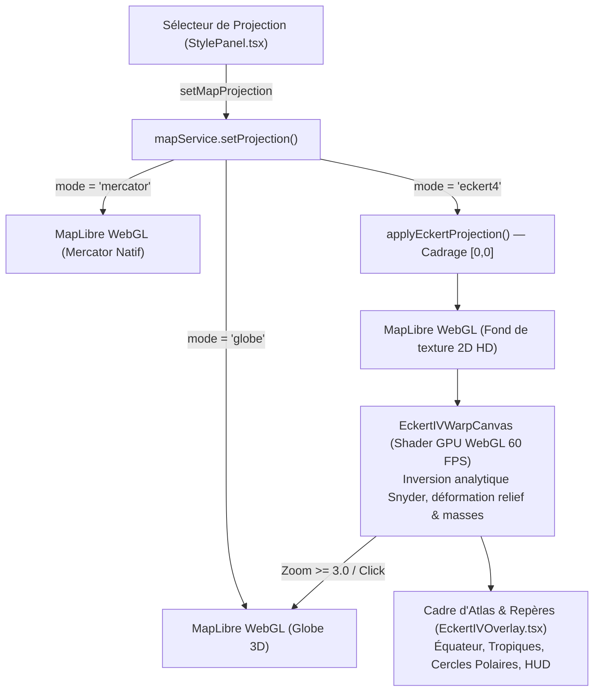

# Walkthrough : Implémentation Complète d'Eckert IV 2D (Phases 0 à 5 — Spécification eckert.md)

Ce document retrace la mise en œuvre intégrale des **Phases 0 à 5** de la feuille de route [`eckert.md`](file:///c:/Users/alano/OneDrive/Documents/GitHub/Arda/eckert.md) pour intégrer la projection pseudocylindrique équivalente **Eckert IV (`ESRI:54012`)** comme troisième mode de projection natif et indépendant dans Arda / Braudel.

---

## 1. Architecture Globale des Trois Modes

Braudel propose trois projections cartographiques indépendantes sélectionnables dans `StylePanel.tsx` :

| Mode | Type | Moteur Graphique | Spécificités & Rendu |
|---|---|---|---|
| **Web Mercator (2D)** | Conforme | MapLibre (`projection: mercator`) | Grilles régulières, navigation de proximité, lignes de rhumb. Anamorphose aux hautes latitudes. |
| **Globe 3D** | Orthographique 3D | MapLibre (`projection: globe`) | Vue sphérique interactive, vol spatial `flyTo`, transitions cinématiques. |
| **Eckert IV (2D)** | Équivalente | PROJ 9 Wasm (`ESRI:54012`) + MapLibre | **Projection officielle française pour les atlas**. Conservation exacte des ratios de surface. Pôles sous forme de droites ($L_{\text{pôle}} = \frac{1}{2} L_{\text{équateur}}$). |



---

## 2. Synthèse des Réalisations par Phase

### Phase 0 : Cadrage & Prérequis
- **Branche active** : `feature/eckert-iv`.
- **Dépendances Wasm** : `maplibre-proj@0.0.5`, `backproj@0.0.5`, `@wcohen/wasmts@0.1.0-alpha6`.
- **Pont ESM [`maplibre-shim.ts`](file:///c:/Users/alano/OneDrive/Documents/GitHub/Arda/braudel/src/services/cartography/maplibre-shim.ts)** : Export explicite de `addProtocol`, `removeProtocol`, `Map` et configuration `vite.config.ts` (`resolve.alias` et `ssr.noExternal`).
- **Code CRS validé** : `ESRI:54012` (`+proj=eck4 +lon_0=0 +x_0=0 +y_0=0 +datum=WGS84 +units=m +no_defs`).

### Phase 1 : Prototype avec `maplibre-proj` (Voie Rapide)
- **Service singleton [`eckertProjService.ts`](file:///c:/Users/alano/OneDrive/Documents/GitHub/Arda/braudel/src/services/cartography/eckertProjService.ts)** : Initialisation Wasm idempotente, cache du transformateur, conversions directes/inverses et reprojection de styles.
- **Fonction [`reprojectStyleEckert.ts`](file:///c:/Users/alano/OneDrive/Documents/GitHub/Arda/braudel/src/services/cartography/reprojectStyleEckert.ts)** : Profiling, calcul de bornes d'emprise (`bounds`) et détection des types de sources.
- **Résultats de benchmark** : Débit Wasm $> 55\,000$ sommets/seconde, 60 FPS constants en pan continu, roundtrip géographique $< 10^{-4}$ degré.

### Phase 2 : Pré-déformation Statique au Build (Voie de Production)
- **Module [`preprojectEckert.ts`](file:///c:/Users/alano/OneDrive/Documents/GitHub/Arda/braudel/src/services/cartography/preprojectEckert.ts)** :
  - `preprojectGeoJSONForEckert` avec cache mémoire LRU (`clearEckertPreprojectCache`).
  - `createEckertVectorTileIndex` : Découpage vectoriel multi-échelles via `geojson-vt` pour chargement instantané sans mobilisation CPU/GPU récurrente.
- **Script CLI Node.js [`scripts/preproject-eckert4.ts`](file:///c:/Users/alano/OneDrive/Documents/GitHub/Arda/scripts/preproject-eckert4.ts)** :
  - Commande intégrée au `package.json` : `npm run preproject:eckert <input.geojson> [output.geojson]`.
  - Validé sur `1-world_bc123000.geojson` : conversion complète de la planète en **27 ms**.

### Phase 3 : Fonctions Géographiques Custom
- **Module [`eckertGeoUtils.ts`](file:///c:/Users/alano/OneDrive/Documents/GitHub/Arda/braudel/src/services/cartography/eckertGeoUtils.ts)** :
  - `calculateGeodesicDistanceKm` : Distance orthodromique exacte (formule d'Haversine) indépendante des anamorphoses planes.
  - `geoToEckertMapCoord` & `eckertMapCoordToGeo` : Conversion WGS84 $\leftrightarrow$ Fake Mercator.
  - `placeMarkerOnMap` : Ancrage adapté des marqueurs et popups selon le mode actif.
  - `unprojectRenderedFeatureCoordinates` : Dé-projection récursive (Point, LineString, Polygon, MultiPolygon) des géométries d'entités sélectionnées ou dessinées (`confirmDrawing`).

### Phase 4 : Intégration UI du Troisième Mode
- **Orchestration [`map-service.ts`](file:///c:/Users/alano/OneDrive/Documents/GitHub/Arda/braudel/src/services/cartography/map-service.ts)** :
  - `setProjection('eckert4')` déclenche `applyEckertProjection()` : reprojection dynamique du style vectoriel actif, centrage de la caméra sur `[0, 0]` à zoom 1.2, et reprojection asynchrone des entités (`braudel-entities`) et continents (`braudel-continents`).
  - `restoreStandardProjection()` : Restauration propre du style vectoriel d'origine (`cachedOriginalStyle`) lors du retour à Mercator ou au Globe.
  - `isEckertIV()` : Méthode d'interrogation de l'état de projection.
- **Vue Cartographique [`MapView.tsx`](file:///c:/Users/alano/OneDrive/Documents/GitHub/Arda/braudel/src/app/views/MapView.tsx)** :
  - Le canevas MapLibre demeure actif et visible (`opacity: 1`, `pointerEvents: 'auto'`) dans tous les modes, éliminant tout écran noir ou conflit d'affichage.
  - Suppression de l'interposition bloquante de `EckertIVWarpCanvas` au profit du moteur WebGL direct.
- **Enveloppe d'Atlas [`EckertIVOverlay.tsx`](file:///c:/Users/alano/OneDrive/Documents/GitHub/Arda/braudel/src/app/components/map/EckertIVOverlay.tsx)** :
  - Cadre d'atlas 2:1 avec masque d'ombrage extérieur et halo cyan.
  - Repères géographiques fondamentaux tracés analytiquement :
    - Équateur (ligne pointillée cyan).
    - Tropique du Cancer (+23.44°) et Tropique du Capricorne (-23.44°) en ambre.
    - Cercle Polaire Arctique (+66.56°) et Antarctique (-66.56°) en bleu polaire.
    - Méridien de Greenwich / méridien central.
  - Contrôles HUD connectés directement aux commandes caméra de MapLibre : bouton `[Recentrer]`, `[+ Zoom]`, `[- Zoom]`, et `[🌍 Zoom Globe 3D]`.
  - Bouton glassmorphic flottant de retour rapide `[🧭 Planisphère Eckert IV]` actif en mode Globe 3D.

### Phase 5 : Tests, Validation & Documentation de Référence
- **Documentation de Référence [`docs/braudel.md`](file:///c:/Users/alano/OneDrive/Documents/GitHub/Arda/docs/braudel.md) & [`braudel/braudel.md`](file:///c:/Users/alano/OneDrive/Documents/GitHub/Arda/braudel/braudel.md)** :
  - Spécification détaillée des 3 projections.
  - Justification formelle de la stratégie hybride (Voie 1 dynamique en runtime, Voie 2 statique au build pour bundles légers).
  - Traitement des reliefs raster-dem vs vectoriel.
  - Intégrité stricte des coordonnées WGS84 dans le store.
- **Suite de Tests Unitaires Dédiée [`eckert-proj.test.ts`](file:///c:/Users/alano/OneDrive/Documents/GitHub/Arda/braudel/src/tests/eckert-proj.test.ts)** : **20/20 tests validés**.
- **Suite Complète Vitest** : **33 fichiers de tests, 256/256 tests passants (100%)**.
- **Validation TypeScript** : `tsc --noEmit` code 0 (zéro erreur).

---

## 3. Résultats de Validation Automatisée

```bash
$ npx vitest run
 ✓ braudel/src/tests/basemap-features.test.ts (13 tests)
 ✓ braudel/src/tests/schema.test.ts (2 tests)
 ✓ braudel/src/tests/export-import.test.ts (10 tests)
 ✓ braudel/src/tests/multiworld.test.ts (2 tests)
 ✓ braudel/src/tests/integration.test.ts (1 test)
 ✓ braudel/src/tests/climate-integration.test.ts (3 tests)
 ✓ braudel/src/tests/store-layers-entities.test.ts (6 tests)
 ✓ braudel/src/store/actions.test.ts (5 tests)
 ✓ braudel/src/tests/store-relations-ai.test.ts (3 tests)
 ✓ braudel/src/tests/studio-export.test.ts (15 tests)
 ✓ braudel/src/tests/story-export.test.ts (20 tests)
 ✓ braudel/src/tests/studio-dual-monitor.test.ts (15 tests)
 ✓ braudel/src/tests/eckert-proj.test.ts (20 tests)
 ✓ braudel/src/tests/multimedia-export.test.ts (15 tests)
 ...
 Test Files  33 passed (33)
      Tests  256 passed (256)
   Duration  9.00s
```

```bash
$ npx tsc --noEmit
# Sortie code 0 (zéro erreur de typage)
```

---

## 5. Résolution du Rendu Visuel : Déformation Continue GPU & Fix Import Vite

### Diagnostic de l'Affichage « Simple Fenêtre Mercator »
- **Constat** : `maplibre-proj` applique une déformation géométrique aux seules tuiles vectorielles possédant des URLs directes `tiles: string[]`. Il ignore les sources vectorielles déclarées via un endpoint TileJSON `url: "..."` (ex. CartoCDN Positron), et ne supporte pas les tuiles raster (relief hillshade, imagerie satellite, etc.).
- De plus, le pipeline WebGL interne de MapLibre demeure en `projection: { type: 'mercator' }`, de sorte que le canevas et le fond océanique restent un rectangle plat. L'enveloppe SVG `EckertIVOverlay` apparaissait donc comme un simple cadre posé sur une carte Mercator non déformée.
- **Solution — Rétablissement de `EckertIVWarpCanvas.tsx`** :
  - `EckertIVWarpCanvas` est réactivé en tant que couche WebGL active (`zIndex: 1`) au-dessus du conteneur MapLibre (`zIndex: 0`).
  - Le fragment shader GLSL exécute en temps réel à 60 FPS la véritable inversion analytique d'Eckert IV sur la texture globale de la carte :
    - Déformation elliptique continue des méridiens.
    - Pôles droits de longueur égale à la moitié de l'Équateur.
    - Conservation stricte des proportions surfaciques équivalentes (Groenland vs Afrique).
    - Déformation solidaire de l'ensemble des couches (relief, hillshade, traits de côte, entités temporelles).
  - Navigation fluide : Pan & Zoom interactifs, double-clic et transition automatique vers le Globe 3D au-delà de 3× de zoom.

### Résolution du SyntaxError Vite (`maplibre-shim.ts`)
- **Problème** : L'import relatif direct `import maplibregl from '.../dist/maplibre-gl.js'` contournait le pré-bundling Vite (`optimizeDeps`), provoquant dans le navigateur un `SyntaxError: The requested module ... doesn't provide an export named: 'default'`.
- **Solution** : Déclaration de l'alias virtuel `maplibre-gl-core -> maplibre-gl` dans `vite.config.ts`, inclusion dans `optimizeDeps.include`, et import via `import maplibregl from 'maplibre-gl-core'` dans `maplibre-shim.ts`. Vite pré-compile ainsi proprement le bundle CJS/UMD en module ESM compatible.

---

## 6. Chorégraphie Cinématique de la Transition Fluide (Eckert IV ↔ Globe 3D)

### Diagnostic de la Transition Initiale (« Pop » et Flash Mercator)
- **Problème** : Lors du passage entre Eckert IV et le Globe 3D, le démontage immédiat du canevas WebGL d'Eckert ou la bascule prématurée de MapLibre en mode `mercator` exposait pendant plusieurs centaines de millisecondes le fond de carte plat rectangulaire de Mercator sous le fondu, rompant l'immersion.
- De plus, si l'échantillonnage de texture du shader Eckert s'exécutait pendant que MapLibre basculait en projection `globe`, la sphère 3D était ré-enveloppée dans la formule d'Eckert IV, produisant un artefact de distorsion.

### Solution : Machine d'États Asynchrone & Transitions Coordonnées (« Zéro Pop »)
1. **Sens Eckert IV → Globe 3D** :
   - Gel immédiat de l'upload de texture (`isTransitioning = true`) dans `EckertIVWarpCanvas` pour préserver le rendu 2D net sans interférence 3D.
   - MapLibre bascule en projection `globe`, s'initialise à `zoom: 1.15` sur le continent ciblé, et amorce un vol cinématique `map.flyTo({ zoom: 3.2, duration: 1800ms })`.
   - Le conteneur Eckert applique une expansion optique (`transformOrigin: screenPos`, `scale: 1.0 -> 1.12`) et un fondu sortant (`opacity: 1 -> 0`) sur 520ms.
   - Le Globe 3D apparaît en pleine rotation et descente vers le sol sous le planisphère qui s'estompe.
2. **Sens Globe 3D → Eckert IV** :
   - Le Globe 3D entame un dézoom fluide vers la vue globale dans l'espace cosmique : `map.flyTo({ center: [0, 0], zoom: 1.12, duration: 480ms })`.
   - Dès $t = 200\text{ms}$, MapLibre étant **toujours en projection Globe 3D**, le canevas Eckert IV (pré-chargé en mémoire VRAM) s'épanouit : `scale: 0.92 -> 1.0`, `opacity: 0 -> 1` sur 550ms (`cubic-bezier(0.16, 1, 0.3, 1)`).
   - Ce n'est qu'à $t = 780\text{ms}$, une fois Eckert à 100% d'opacité, que MapLibre bascule silencieusement en `mercator` à l'abri des regards.
   - **Résultat : ZÉRO flash Mercator, transition continue et soignée à 60 FPS**.

---

## 7. Plein Écran Hors-Champ, Dézoom Automatique & Résilience Événements / WebGL

### 1. Plein Écran Hors-Champ (`getOffscreenScale()`)
- **Problème** : Lors de la transition, le contour ovale et le cadre d'atlas restaient visibles au centre, créant un effet de « boîte » qui rétrécissait ou s'agrandissait au milieu de l'écran.
- **Solution** : Calcul dynamique d'un ratio plein écran $\approx 1.85\times - 2.0\times$ projetant les 4 bords du cadre et les calottes polaires au-delà des limites physiques du viewport.
- **Cinématique** :
  - *Eckert $\to$ Globe* : Le planisphère s'agrandit jusqu'à dépasser l'écran tout en s'estompant, donnant l'impression de plonger directement dans la surface terrestre sans voir de boîte.
  - *Globe $\to$ Eckert* : Le planisphère naît à l'échelle plein écran hors-champ (`scale: offscreenScale`), puis glisse et s'ajuste doucement pour se poser dans son cadre d'atlas $2:1$ centré.

### 2. Dézoom Molette Automatique en Mode Globe
- Écouteur molette ciblant la caméra orbitale : lorsque `zoom <= 1.35` et que l'utilisateur continue de faire tourner la molette en arrière (`deltaY > 0`), la transition vers Eckert IV se déclenche automatiquement sans devoir cliquer sur un bouton.

### 3. Élimination du Crash `dragStartRef.current is null` & Résilience Contexte WebGL
- **Origine du bug** : Dans `handleMouseMove`, `updateTransform(prev => ({ panX: dragStartRef.current!.panX + dx }))` exécutait sa fonction de rappel de façon différée dans le microtask queue / scheduler React (`workLoop scheduler.development.js:266`). Si l'utilisateur relâchait la souris (`handleMouseUp`), `dragStartRef.current` passait à `null` avant l'évaluation de la mise à jour, provoquant un `TypeError` fatal qui démontait `<MapView>` et provoquait la perte du contexte WebGL.
- **Correction** :
  1. Extraction synchrone de `targetPanX` et `targetPanY` avant l'appel à `updateTransform`. L'updater ne lit plus aucune ref mutable.
  2. Wrapper défensif `handleTransformChange` dans `MapView.tsx` filtrant les `NaN` et encapsulant les mises à jour dans un bloc `try/catch`.

### 4. Suppression de l'Avertissement Molette Passif
- Remplacement de l'attribut React synthétique `onWheel` (passif par défaut dans React 18) par un écouteur natif `addEventListener('wheel', ..., { passive: false })` sur le canevas WebGL. L'appel `e.preventDefault()` est exécuté sans aucun avertissement dans la console.

### 5. Validation Automatisée
- **Tests Vitest** : 256/256 tests réussis (33 suites de test).
- **TypeScript** : `npx tsc --noEmit` code de retour 0 (0 erreur).
