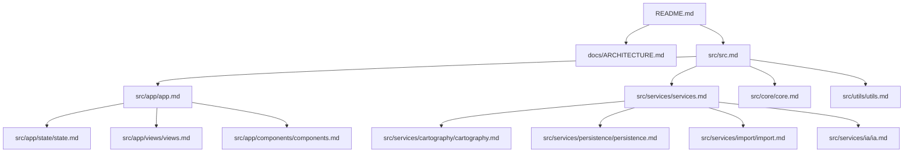
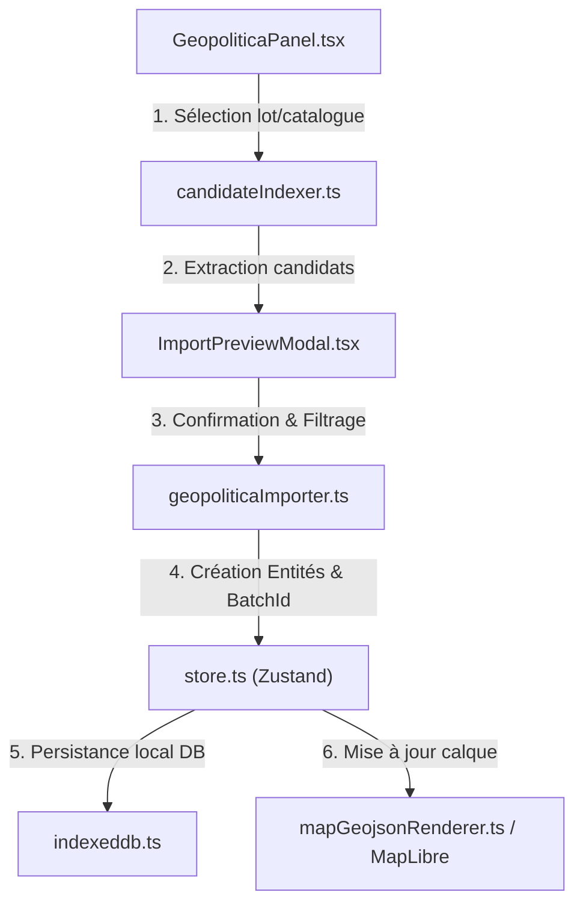
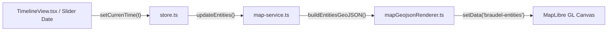

# Architecture Générale - ARDA / Braudel / Tolkien

## Présentation Synthétique

Le projet **Braudel / Tolkien (ARDA)** est une application Web de cartographie historique, d'analyse temporelle et de modélisation de réseaux pour mondes réels et imaginaires. 

L'architecture s'appuie sur une modularité stricte (fichiers < 200 lignes), une persistance locale dans IndexedDB, un rendu vectoriel haute performance avec MapLibre GL, et une couche d'assistance IA (Ollama & vision locale).

---

## Carte des Secteurs Principaux

| Secteur | Emplacement | Rôle Principal | Doc |
|---|---|---|---|
| **`app/state/`** | `src/app/state/` | Gestion de l'état global Zustand (mondes, entités, calques, IA) | [state.md](file:///c:/Users/alano/WebstormProjects/braudel/braudel/src/app/state/state.md) |
| **`app/views/`** | `src/app/views/` | Composants UI principaux, vues cartographiques et panneaux de contrôle | [views.md](file:///c:/Users/alano/WebstormProjects/braudel/braudel/src/app/views/views.md) |
| **`app/components/`** | `src/app/components/` | Composants UI réutilisables (modales, listes, formulaires) | [components.md](file:///c:/Users/alano/WebstormProjects/braudel/braudel/src/app/components/components.md) |
| **`services/`** | `src/services/` | Services techniques transverses (cartographie, persistance, import, IA) | [services.md](file:///c:/Users/alano/WebstormProjects/braudel/braudel/src/services/services.md) |
| **`core/`** | `src/core/` | Modèles de données, schémas Zod, algorithmes réseau & filtres | [core.md](file:///c:/Users/alano/WebstormProjects/braudel/braudel/src/core/core.md) |
| **`acquisition/`** | `src/acquisition/` | Vectorisation, dessin à main levée, traitement d'images | [acquisition.md](file:///c:/Users/alano/WebstormProjects/braudel/braudel/src/acquisition/acquisition.md) |

---

## Diagramme des Dépendances de la Documentation Wiki-as-Code

Le graphe complet d'interconnexion entre la racine, les secteurs et les fiches individuelles `.md` est disponible dans [docs/wiki-graph.mmd](wiki-graph.mmd).

---

## Diagrammes des Flux Principaux

### 1. Flux d'Importation & Normalisation GeoJSON

### 2. Flux de Rendu Cartographique & Filtrage Temporel

---

## Fil d'Ariane & Navigation

[Projet Braudel (Racine)](../README.md) -> **ARCHITECTURE.md** -> [src/ (Code Source)](../braudel/src/src.md)
