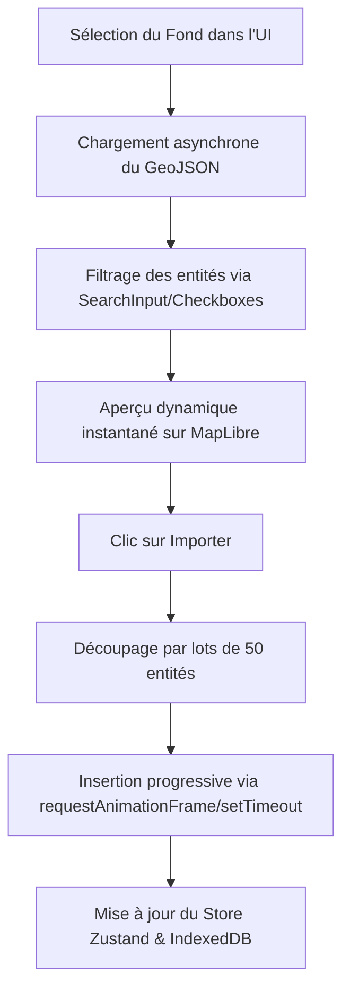

# Rapport d'Audit & Guide d'Utilisation — Interface des Fonds GeoJSON (Géopolitica)

Ce document présente l'audit et la documentation de l'interface utilisateur conçue pour l'intégration et la manipulation des fonds historiques GeoJSON de **Géopolitica** dans le mode **Braudel** de l'application **Arda**.

---

## 1. Description du Panneau « Fonds Géopolitica »

Le panneau de gestion des fonds historiques est disponible uniquement dans la barre latérale gauche sous le mode de cartographie réelle **Braudel**. Il est masqué en mode Tolkien (monde fictif).

### Structure des Éléments d'Interface

1. **Activation Globale (« Activer les fonds historiques »)**
   - Une case à cocher permet d'activer ou de désactiver la fonctionnalité de superposition historique.
   - Désactivée par défaut pour économiser les ressources au chargement initial du projet.

2. **Sélection de la Couche Cible**
   - Un menu déroulant liste toutes les couches actives du projet (Physique, Historique, Politique).
   - Les entités géopolitiques importées seront injectées directement dans la couche sélectionnée.

3. **Options Chronologiques (Boutons Radio)**
   - **Mode Automatique** : Calcule les périodes de validité (`temporalRange`) de manière continue et sans chevauchement. Une couche commence à son année de référence et se termine là où la couche chronologique suivante commence.
   - **Mode Manuel** : Assigne par défaut une durée fixe de 1000 ans à chaque fond importé, modifiable ensuite entité par entité dans le panneau classique.

4. **Options d'Optimisation géométrique**
   - **Fusion Homonyme** : Coche permettant de mettre à jour la géométrie d'une entité existante portant le même nom historique au lieu de générer un doublon.

---

## 2. Le Système d'Exploration Pré-Import (Accordéons Dynamiques)

Lorsque l'utilisateur sélectionne un fond compatible avec la chronologie du projet (intersectant `[startYear, endYear]`), un accordéon se crée pour ce fichier.

### Fonctionnalités de Recherche et de Sélection
- **Chargement Asynchrone** : Le fichier GeoJSON n'est chargé en mémoire (via `fetch`) que lorsque l'utilisateur coche la case du fond correspondant.
- **Extraction des Entités Uniques** : L'interface extrait dynamiquement les valeurs du fichier GeoJSON (en cascade `NAME` → `SUBJECTO` → `CONTINENT`) et les affiche sous forme de liste.
- **Moteur de Recherche Interne** : Un champ de saisie permet de filtrer la liste des entités en temps réel (ex: taper "Rome" ou "Persia" pour cibler un empire précis).
- **Raccourcis de Sélection** : Deux boutons permettent de cocher (« Tous ») ou décocher (« Aucun ») les entités d'un clic rapide.

---

## 3. Flux Technique d'Importation & Chargement Progressif

---

## 4. Diagnostic, Aperçu Direct et Chargement par Lots

### Aperçu Cartographique Direct sur la Carte
- Afin de permettre à l'utilisateur de valider ses choix visuellement avant d'ajouter définitivement des données au projet, l'application intègre désormais un **aperçu en temps réel**.
- Dès qu'un fond historique est coché et que des civilisations sont sélectionnées dans le panneau latéral, elles s'affichent instantanément en surbrillance bleue (`geopolitica-preview-layer`) sur la carte MapLibre.
- Les filtres de recherche textuelle et les cases à cocher individuelles se répercutent de manière fluide et instantanée sur le rendu de la carte.

### Chargement Progressif par Lots (Batching)
- L'ancienne approche de simplification de tracé (`simplify-js`) a été retirée au profit d'un **chargement progressif**.
- Lors de l'importation de gros fichiers (ex: l'an 1492 ou 2024 qui comptent des milliers de polygones complexes), les données sont injectées dans le store Zustand par **lots successifs de 50 entités**.
- Ce découpage asynchrone évite de geler le thread principal du navigateur. L'utilisateur peut continuer d'interagir avec la carte pendant que les frontières apparaissent progressivement à l'écran. Un indicateur de pourcentage d'avancement est affiché sur le bouton d'importation.

---

## 5. Recommandations d'Ergonomie (PC / Mobile / Promethean)

- **Sur Écran Standard (PC)** : L'intégration sous forme d'accordéon avec défilement vertical interne évite de surcharger la hauteur de la barre latérale.
- **Sur Tablette & Promethean (Mode Stylet)** :
  - Les cases à cocher de chaque empire/civilisation dans la liste d'accordéon sont espacées de manière à pouvoir être ciblées facilement au doigt ou au stylet interactif.
