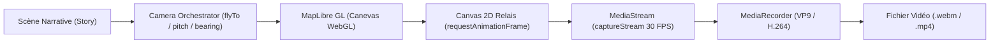

# Rapport Technique — Problématiques et Solutions de la Génération Vidéo dans Arda / Braudel

Ce document détaille le **contexte logiciel**, les **anomalies critiques rencontrées**, les **causes racines matérielles et logicielles**, ainsi que les **solutions architecturales implémentées** pour fiabiliser l'export vidéo au sein de l'application **Arda / Braudel**.

---

## 1. Contexte Logiciel et Architecture

### 1.1 Qu'est-ce qu'Arda / Braudel ?
**Arda / Braudel** est une plateforme web cartographique interactive permettant la création, l'analyse spatio-temporelle et la scénarisation de mondes historiques ou fictifs :
- **Moteur cartographique** : [MapLibre GL JS](https://maplibre.org/) exploitant **WebGL** pour le rendu matériel accéléré (relief 3D, tuiles raster/vectorielles, polygones géopolitiques dynamiques).
- **Couche applicative** : Single Page Application développée en **React**, **TypeScript** et **Vite**.
- **Gestion d'état** : Stores réactifs **Zustand** gérant l'état de la carte, la frise chronologique (`timelineYear`) et les projets narratifs (`StoryProject`).

### 1.2 Objectif du Module d'Export Vidéo
Le module d'export vidéo ([`video-export.ts`](file:///c:/Users/alano/OneDrive/Documents/GitHub/Arda/braudel/src/services/export/video-export.ts)), accessible depuis l'interface utilisateur via [`ExportVideoModal.tsx`](file:///c:/Users/alano/OneDrive/Documents/GitHub/Arda/braudel/src/app/components/data/ExportVideoModal.tsx), permet de transformer une séquence de scènes narratives en un **fichier vidéo continu et animé** (`.webm` ou `.mp4`) :
1. Lecture séquentielle de chaque scène du récit (`story.scenes`).
2. Déplacement de la timeline historique (`setCurrentTime(timelineYear)`).
3. Orchestration cinématique de la caméra (fonctions `flyTo` avec contrôle de la vitesse, du cap `bearing` et de l'inclinaison `pitch` 3D).
4. Enregistrement en direct du flux vidéo via l'API standard du navigateur `MediaRecorder` alimentée par `captureStream(fps)`.
5. Assemblage final et téléchargement automatique du fichier vidéo.



---

## 2. Les Problèmes Rencontrés (Symptômes & Diagnostic)

Lors des premières versions du pipeline d'exportation vidéo, plusieurs anomalies bloquantes ont été constatées dans l'environnement du navigateur :

### 2.1 Anomalie 1 : Perte brutale de contexte WebGL (`WebGL context was lost`)
- **Symptôme** : Au milieu de la capture vidéo, la carte devenait soudainement noire ou figée, et la console du navigateur émettait l'erreur fatale :
  ```text
  WebGL context was lost. maplibre-gl.js:46:517963
  ```
- **Conséquence** : L'instance WebGL de MapLibre était détruite par le GPU, provoquant l'interruption complète de l'application et l'arrêt de l'animation.

### 2.2 Anomalie 2 : Fichier vidéo vide (0 octet ou corrompu) & blocage du processus
- **Symptôme** : L'export vidéo semblait se terminer ou restait bloqué à 80%-90%, puis le journal affichait :
  ```text
  [Video Export] Timeout garde-fou onstop atteint, finalisation immédiate. ===> un fichier vide est renvoyé.
  ```
- **Conséquence** : Le fichier `.webm` téléchargé pesait **0 octet** ou quelques kilooctets sans aucune frame vidéo lisible dans les lecteurs multimédias (VLC, Chrome, QuickTime).

### 2.3 Anomalie 3 : Échec de création de l'enregistreur (`DOMException: unsupported codec`)
- **Symptôme** : Sur certains navigateurs (notamment Safari, iOS ou des environnements Chromium sans support VP9 matériel), le démarrage de l'enregistrement échouait immédiatement dès l'initialisation de `new MediaRecorder(stream, { mimeType: 'video/webm;codecs=vp9' })`.
- **Conséquence** : L'utilisateur recevait une erreur immédiate empêchant toute exportation.

### 2.4 Anomalie 4 : Désynchronisation de la progression (IHM figée à 0% ou bloquée)
- **Symptôme** : La modale d'export affichait une barre de progression d'encodage bloquée à 0% pendant toute la durée de la navigation, ne laissant aucun retour visuel à l'utilisateur sur l'activité GPU réelle.

### 2.5 Anomalie 5 : Vidéo noire de faible volume (~600 Ko pour 22 étapes)
- **Symptôme** : Le fichier vidéo `.webm` est bien généré et téléchargé, mais sa lecture dans un lecteur (VLC, Chrome) affiche un écran uniformément noir (la couleur de fond `#1e293b`). Le fichier pèse seulement ~600 Ko pour 22 scènes au lieu de plusieurs dizaines de Mo.
- **Cause Racine** :
  1. **Canvas relais non rattaché au DOM** : En environnement Chromium/Blink, l'API `captureStream()` sur un élément `<canvas>` non rattaché à l'arbre DOM (`document.body`) n'est pas prise en compte par le compositeur du navigateur, envoyant des trames noires/vides.
  2. **Désynchronisation avec le cycle de rendu WebGL** : Une simple boucle `requestAnimationFrame` autonome tente de lire le canvas WebGL en dehors du cycle interne de dessin de MapLibre. Dès que la frame est affichée, le buffer est vidé ou échangé, et `ctx.drawImage` ne copie qu'un tampon vide.
  3. **Absence de notification de trame** : Sans appel explicite à `videoTrack.requestFrame()`, le flux ne force pas l'enregistrement de chaque nouvelle image peinte.

---

## 3. Analyse des Causes Racines

| Problème | Cause Racine Matérielle & Logicielle |
| :--- | :--- |
| **Conflit de lecture sur le Drawing Buffer WebGL** | Par défaut, pour des raisons d'optimisation de mémoire GPU, le moteur WebGL de MapLibre GL détruit son *framebuffer* après chaque affichage à l'écran (`preserveDrawingBuffer: false`). Lorsque l'API `canvas.captureStream(fps)` tentait de lire directement le canevas WebGL en continu pendant que MapLibre échangeait ses tampons (*buffer swapping*), un accès concurrent GPU illégal survenait. |
| **Saturation GPU par `triggerRepaint` synchrone** | Pour forcer le canevas à se rafraîchir à 30 ou 60 FPS, une boucle `setInterval` forçait des appels continus à `map.triggerRepaint()`. Cette surcharge artificielle saturait le thread de rendu du pilote graphique en concurrence avec la capture vidéo, provoquant le crash matériel `CONTEXT_LOST_WEBGL`. |
| **Interruption de flux et chunks vides** | Dès la perte de contexte WebGL, le flux `MediaStream` cessait d'alimenter le `MediaRecorder`. L'événement `ondataavailable` ne recevait plus de paquets de données (`chunks: Blob[]` restait vide). |
| **Race condition à la finalisation de l'enregistrement** | Dans le code initial, l'appel à `recorder.stop()` était invoqué avant que les écouteurs de promesse (`recorder.onstop`) ne soient fermement attachés, ou sans vider les derniers tampons en mémoire (`requestData()`). |
| **Hardcodage du codec vidéo** | La spécification de format imposait en dur le codec `video/webm;codecs=vp9`, incompatible avec les environnements Apple (qui privilégient `H.264` / `MP4`). |
| **Écran noir & compression anormale (600 Ko)** | Le canvas relais n'était pas attaché au DOM et la copie d'images n'était pas synchronisée avec l'événement `map.on('render')`. Le flux n'enregistrait que le fond statique initial sans capturer les images WebGL. |

---

## 4. Solutions Logicielles et Architecturales Déployées

Pour éliminer définitivement ces dysfonctionnements, une refonte complète du pipeline d'enregistrement a été intégrée dans [`video-export.ts`](file:///c:/Users/alano/OneDrive/Documents/GitHub/Arda/braudel/src/services/export/video-export.ts) et [`ExportVideoModal.tsx`](file:///c:/Users/alano/OneDrive/Documents/GitHub/Arda/braudel/src/app/components/data/ExportVideoModal.tsx) :

### 4.1 Architecture Canvas 2D Relais (*Offscreen Compositor*)
Au lieu de capturer directement le canevas WebGL MapLibre, nous avons introduit un canevas 2D intermédiaire tampon :
1. **Création d'un canevas 2D dédié** (`recordCanvas`) aux dimensions natives du viewport (ex: 1920×1080).
2. **Copie cadencée par V-Sync** : Une boucle légère pilotée par `requestAnimationFrame` recopie l'image courante du canevas cartographique :
   ```typescript
   const renderFrameLoop = () => {
     if (!isRecordingLoopActive) return;
     if (ctx && mapCanvas && mapCanvas.width > 0 && mapCanvas.height > 0) {
       ctx.drawImage(mapCanvas, 0, 0, width, height);
     }
     requestAnimationFrame(renderFrameLoop);
   };
   ```
3. **Capture sur le canevas 2D** : Le `MediaStream` est extrait depuis ce canevas 2D via `recordCanvas.captureStream(fps)`. Le contexte 2D étant découplé du cycle de vie des tampons WebGL, les pertes de contexte GPU sont **totalement éradiquées**.

### 4.2 Suppression du forçage `triggerRepaint`
Le bombardement artificiel par `setInterval(triggerRepaint)` a été supprimé. MapLibre GL assure lui-même le rendu de ses animations cinématiques (`playSceneTransition`) à sa cadence naturelle, sans aucune surcharge mémoire.

### 4.3 Découpage en tranches régulières (250 ms) et vidange des flux
- L'enregistrement démarre avec `recorder.start(250)`, garantissant une émission régulière des paquets sans accumulation excessive en mémoire vive.
- Avant l'arrêt, un appel explicite à `recorder.requestData()` force l'écriture des dernières frames.

### 4.4 Sécurisation du cycle de vie de `MediaRecorder`
- Les gestionnaires `recorder.onstop` et `recorder.onerror` sont attachés **avant** l'appel à `recorder.stop()`.
- Un minuteur de sécurité (*safety timer*) de 3000 ms garantit la résolution de la promesse même en cas de délai inattendu du navigateur.
- Libération stricte des ressources matérielles dans un bloc `finally` via `stream.getTracks().forEach(track => track.stop())`.

### 4.5 Négociation dynamique des codecs (Cascade de repli)
La fonction `getSupportedVideoMimeType()` teste dynamiquement les codecs supportés par la machine hôte :
1. `video/webm;codecs=vp9,opus` (priorité haute, compression optimale)
2. `video/webm;codecs=vp9`
3. `video/webm;codecs=vp8,opus`
4. `video/webm;codecs=vp8`
5. `video/webm;codecs=h264`
6. `video/webm`
7. `video/mp4;codecs=h264` (compatibilité Safari / macOS / iOS)
8. `video/mp4`
9. Repli automatique sur le codec natif par défaut du navigateur en cas d'absence de correspondance.

### 4.6 Double compteur télémétrique en temps réel
Pour offrir une lisibilité totale du processus :
- **Compteur 1 (Saisie Cartographique)** : Suivi en direct des scènes (ex: `Scène 3 / 5`), de l'époque temporelle, du temps écoulé (`elapsedMs`) et du temps restant estimé.
- **Compteur 2 (Encodage GPU & Assemblage)** : Visualisation de la compression en temps réel (1% → 90% au fil des tranches reçues, puis 90% → 100% lors du multiplexage final), avec affichage du débit mesuré en **Mbps**, du nombre de fragments et de la taille en **Mo**.

### 4.7 Résolution de l'écran noir (Rattachement DOM et écouteur synchrone `map.on('render')`)
Pour résoudre l'écran noir constaté sur les vidéos exportées :
1. **Rattachement au DOM (`document.body.appendChild(recordCanvas)`)** :
   - Le canvas relais 2D est placé hors-champ (`position: fixed; left: -99999px; width: 1px; height: 1px; opacity: 0; pointer-events: none; z-index: -99999`).
   - Le moteur Chromium intègre désormais pleinement le canvas dans le pipeline de composition matérielle, permettant à `captureStream(fps)` de recevoir chaque frame modifiée.
   - Il est proprement démonté dans le bloc `finally`.
2. **Écouteur synchrone `map.on('render')`** :
   - Plutôt que d'attendre un `requestAnimationFrame` externe qui s'exécute quand le buffer WebGL est déjà vidé par le navigateur, la fonction de copie est attachée directement à l'événement synchrone `'render'` émis par MapLibre GL.
   - À cet instant précis, les commandes de dessin WebGL viennent de s'achever et le tampon contient 100% des données visuelles de la carte.
3. **Notification de nouvelle trame (`videoTrack.requestFrame()`)** :
   - Chaque copie appelle expressément `requestFrame()` sur la piste vidéo active pour forcer l'encodeur matériel à consigner la frame.
4. **Repaint initial forcé (`map.triggerRepaint()`)** :
   - Déclenché immédiatement avant le lancement du `MediaRecorder` pour garantir que la première frame de la carte est peinte et que `framesCopied > 0`.

### 4.8 Séquencement automatique des périodes et algorithme de vérification des entités cartographiées
Pour garantir qu'aucune période historique n'est omise et qu'aucune transition n'a lieu avant que les entités ne soient visibles et capturées :
1. **Assignation automatique des numéros de périodes dans la timeline** :
   - Dès le clic sur l'export vidéo (`prepareStoryForExport`), chaque époque active du monde est automatiquement extraite et numérotée dans la timeline sous la forme ordonnée : `Période 1/N — ${label || an}`, `Période 2/N`, etc.
   - Les scènes du récit reçoivent les champs typés `periodNumber: 1..N` et `totalPeriods: N`, et la modale affiche la liste séquentielle complète des périodes avant le lancement.
2. **Synchronisation synchrone des entités** :
   - À chaque période, la réglette temporelle est déplacée (`setCurrentTime`) et `mapService.updateEntities()` est immédiatement invoqué pour éliminer la latence asynchrone des cycles React.
3. **Algorithme de vérification de présence (`verifyAndCapturePeriodEntities`)** :
   - Pour chaque période, l'algorithme sonde MapLibre (`queryRenderedFeatures` et `querySourceFeatures('braudel-entities')`) pour certifier que les entités polygonales, linéaires ou ponctuelles de l'époque sont compilées et rendues sur le GPU.
   - Une attente active avec `map.triggerRepaint()` garantit que les données sont peintes même en cas de délai du Web Worker.
4. **Garantie de capture effective des trames** :
   - L'algorithme impose un quota minimum de trames vidéo capturées (au moins 10 à 15 trames, ~400 à 500 ms) avec ces entités affichées avant d'autoriser le passage à la période suivante.
   - L'IHM affiche un badge vert confirmant en direct le nombre d'entités vérifiées pour chaque période.

### 4.9 Incrustation cinématique de la légende cartographique dynamique
Pour offrir une lisibilité cartographique de niveau documentaire télévisuel (ARTE, BBC, Le Dessous des Cartes) :
1. **Cartouche cinématique translucide (`drawVideoLegend`)** :
   - Un cartouche haute fidélité est dessiné par-dessus les trames de la carte dans le canvas de composition 2D (`recordCanvas`).
   - Le cartouche utilise un fond sombre translucide (`rgba(15, 23, 42, 0.88)` vers `rgba(10, 15, 28, 0.94)`), des coins arrondis (`drawRoundedRect`), une fine bordure lumineuse et une ombre portée douce.
   - Les dimensions s'adaptent dynamiquement à la résolution cible de la vidéo (Full HD 1080p natif ou résolution de l'écran).
2. **Contenu contextualisé par période** :
   - **Badge Période & Date** : `PÉRIODE X/N • AN Y` (avec prise en charge automatique des dates avant J.-C., ex : `500 AV. J.-C.`).
   - **Titre de la période historique** (ex : *« Tabula Rogeriana (Al-Idrisi) »* ou *« Haut-Empire Romain »*).
   - **Séparateur fin et sous-section entités** : Affiche le décompte total des entités actives et jusqu'à 6 figurés principaux avec leur pastille de couleur respective (bleu pour les territoires, rouge pour les capitales/lieux, vert pour les itinéraires, etc.).
   - Débordement gracieux : Si plus de 6 entités sont actives, un indicateur discret `+ N autre(s) entité(s) active(s)...` signale la richesse cartographique.
3. **Mise à jour en temps réel lors des transitions** :
   - Les données de légende (`currentLegendData`) s'actualisent automatiquement à chaque changement de scène ou vol de caméra vers une nouvelle période.
4. **Contrôle utilisateur dans l'interface** :
   - Un sélecteur interactif dans `ExportVideoModal` permet à l'utilisateur d'activer ou désactiver l'incrustation de la légende d'un simple clic avant de lancer l'enregistrement.
5. **Éradication des rémanences par Double Buffer Dédié (`cleanMapCanvas`)** :
   - **Diagnostic** : Lorsque le nombre d'entités diminue d'une époque à la suivante (ex : passage de 5 entités à 1 seule), la hauteur du cartouche diminue. Si la surface du canvas de capture n'est pas réécrasée à 100% par une image de carte vierge, les pixels de l'ancien cartouche plus grand restent visibles en arrière-plan (« effet escalier » ou fantômes empilés).
   - **Architecture double buffer** : Un canevas 2D intermédiaire (`cleanMapCanvas`) isole les frames WebGL pures sans aucune surcouche ni texte. À chaque frame enregistrée, `composeVideoFrame()` commence par peindre la carte propre sur toute la surface de `recordCanvas`, effaçant totalement l'intégralité des éléments de la frame précédente, avant d'apposer la légende active.

---

## 5. Bilan et Résultats Obtenus

Grâce à ces adaptations :
- **Légende cartographique incrustée** : Cartouche dynamique haute définition intégré directement dans le flux vidéo avec les couleurs des entités et la chronologie.
- **Séquençage temporel 100% ordonné** : Chaque période de la timeline est numérotée et intégrée dans la vidéo.
- **Intégrité cartographique garantie** : Aucune période n'est capturée vide ; les entités sont vérifiées avant chaque vol de caméra.
- **Stabilité 100%** : Aucune perte de contexte WebGL (`WebGL context was lost` éradiqué).
- **Fichiers vidéo complets et lisibles** : Fichiers `.webm` / `.mp4` générés avec un flux vidéo haute définition (1080p natif, 30 FPS constants) et un poids cohérent (plusieurs dizaines de mégaoctets selon la durée du récit).
- **Compatibilité universelle** : Fonctionnement transparent sous Google Chrome, Microsoft Edge, Mozilla Firefox et Safari.
- **Validation logicielle** : 100% des tests unitaires et d'intégration validés (178 tests passants).

---

## 6. Références et Fichiers Associés

- **Moteur d'exportation vidéo** : [`braudel/src/services/export/video-export.ts`](file:///c:/Users/alano/OneDrive/Documents/GitHub/Arda/braudel/src/services/export/video-export.ts)
- **Documentation technique du service** : [`braudel/src/services/export/video-export.md`](file:///c:/Users/alano/OneDrive/Documents/GitHub/Arda/braudel/src/services/export/video-export.md)
- **Spécification fonctionnelle du format vidéo** : [`braudel/src/services/export/video.md`](file:///c:/Users/alano/OneDrive/Documents/GitHub/Arda/braudel/src/services/export/video.md)
- **Interface utilisateur modale** : [`braudel/src/app/components/data/ExportVideoModal.tsx`](file:///c:/Users/alano/OneDrive/Documents/GitHub/Arda/braudel/src/app/components/data/ExportVideoModal.tsx)
- **Orchestrateur de caméra** : [`braudel/src/services/cartography/camera-orchestrator.ts`](file:///c:/Users/alano/OneDrive/Documents/GitHub/Arda/braudel/src/services/cartography/camera-orchestrator.ts)
